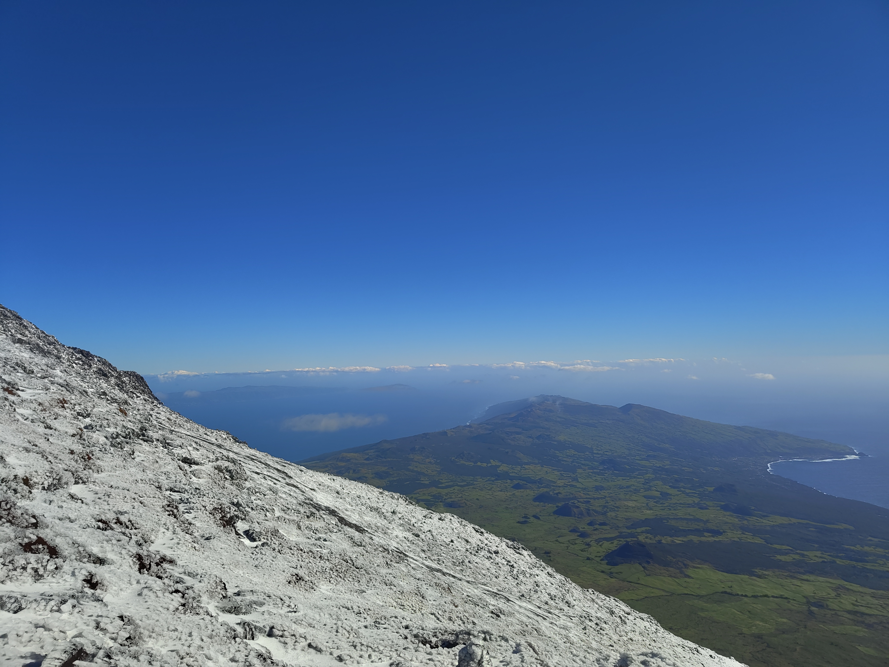

From the moment we are born to the moment we die, we are free falling; we are actually free falling way before we are born — or before becoming conscious — and we will continue to free fall after we die — or after becoming unconscious again.

Our existential dread comes when we become aware of this free fall, because this free fall is scary and uncertain, so we try to hold on to anything that can give us an illusion of deceleration. These things that we hold on to include belief systems, religions, thought patterns, routines, relationships, etc.

Perhaps we just need to give in to this free fall in order to fully live?

*Landscape View from Mount Pico, Ilha do Pico, Azores*